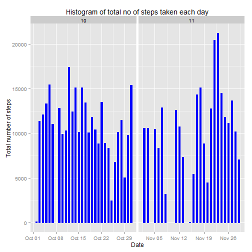
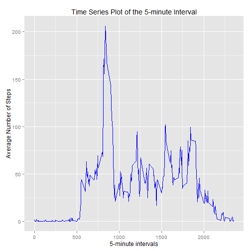
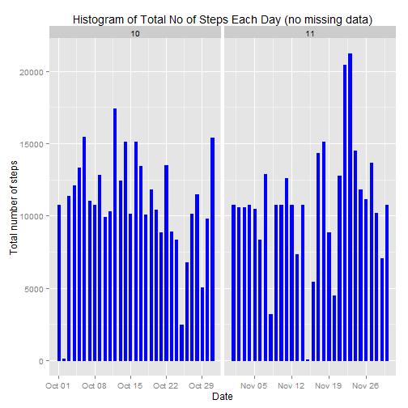

Reproducible Research: Peer Assessment 1
=====================
J Liu March 2015


```r
echo = TRUE  # code visible
options(scipen = 1)  # Turn off scientific notations for numbers
```

##Loading and processing the data


```r
setwd("C:/Users/JZ/Desktop/5_ReproducibleResearch/Project1")
getwd()
```

```
## [1] "C:/Users/JZ/Desktop/5_ReproducibleResearch/Project1"
```

```r
unzip("activity.zip")
data = read.csv("activity.csv", colClasses = c("integer", "Date", "factor"))
data$month = as.numeric(format(data$date, "%m"))
noNA = na.omit(data)
rownames(noNA) = 1:nrow(noNA)
library(ggplot2)
```

##What is mean total number of steps taken per day?

Histogram of the total number of steps taken each day


```r
ggplot(noNA, aes(date, steps)) + geom_bar(stat = "identity", colour = "blue", fill = "blue", width = 0.5) + facet_grid(. ~ month, scales = "free") + labs(title = "Histogram of total no of steps taken each day", x = "Date", y = "Total number of steps")
```

 
   
Calculate and report the mean and median total number of steps taken per day

Mean:


```r
totalSteps = aggregate(noNA$steps, list(Date = noNA$date), FUN = "sum")$x
mean(totalSteps)
```

```
## [1] 10766.19
```

Median:


```r
median(totalSteps)
```

```
## [1] 10765
```

##What is the average daily activity pattern?

Make a time series plot (i.e. type = "l") of the 5-minute interval (x-axis) and the average number of steps taken, averaged across all days (y-axis)


```r
avgSteps = aggregate(noNA$steps, list(interval = as.numeric(as.character(noNA$interval))), FUN = "mean")
names(avgSteps)[2] = "meanSteps"

ggplot(avgSteps, aes(interval, meanSteps)) + geom_line(color = "blue", size = 0.5) + labs(title = "Time Series Plot of the 5-minute Interval", x = "5-minute intervals", y = "Average Number of Steps")
```

 

Which 5-minute interval, on average across all the days in the dataset, contains the maximum number of steps?


```r
avgSteps[avgSteps$meanSteps == max(avgSteps$meanSteps), ]
```

```
##     interval meanSteps
## 104      835  206.1698
```


##Imputing missing values

The total number of rows with NAs:


```r
sum(is.na(data))
```

```
## [1] 2304
```

Devise a strategy for filling in all of the missing values in the dataset. The strategy does not need to be sophisticated. For example, you could use the mean/median for that day, or the mean for that 5-minute interval, etc.

Use the mean for the 5-minute interval to fill NA value.


Create a new dataset that is equal to the original dataset but with the missing data filled in.


```r
newData = data 
for (i in 1:nrow(newData)) {
    if (is.na(newData$steps[i])) {
        newData$steps[i] = avgSteps[which(newData$interval[i] == avgSteps$interval), ]$meanSteps
    }
}
sum(is.na(newData))
```

```
## [1] 0
```

Make a histogram of the total number of steps taken each day 


```r
ggplot(newData, aes(date, steps)) + geom_bar(stat = "identity",
                                             colour = "blue",
                                             fill = "blue",
                                             width = 0.5) + facet_grid(. ~ month, scales = "free") + labs(title = "Histogram of Total No of Steps Each Day (no missing data)", x = "Date", y = "Total number of steps")
```

 

Calculate and report the mean and median total number of steps taken per day.Do these values differ from the estimates from the first part of the assignment? What is the impact of imputing missing data on the estimates of the total daily number of steps?

Mean:


```r
newTotalSteps = aggregate(newData$steps, 
                           list(Date = newData$date), 
                           FUN = "sum")$x
newMean = mean(newTotalSteps)
newMean
```

```
## [1] 10766.19
```

Median:


```r
newMedian = median(newTotalSteps)
newMedian
```

```
## [1] 10766.19
```

Compare them with the two before:


```r
oldMean = mean(totalSteps)
oldMedian = median(totalSteps)
newMean - oldMean
```

```
## [1] 0
```

```r
newMedian - oldMedian
```

```
## [1] 1.188679
```

After imputing the missing data, the new mean is the same as the old mean; the new median is greater than that of the old median.

##Are there differences in activity patterns between weekdays and weekends?

Create a new factor variable in the dataset with two levels -- "weekday" and "weekend" indicating whether a given date is a weekday or weekend day.


```r
newData$weekdays = factor(format(newData$date, "%A"))
levels(newData$weekdays) = list(weekday = c("Monday", "Tuesday", "Wednesday", "Thursday", "Friday"),
                                 weekend = c("Saturday", "Sunday"))
levels(newData$weekdays)
```

```
## [1] "weekday" "weekend"
```

```r
table(newData$weekdays)
```

```
## 
## weekday weekend 
##   12960    4608
```

Make a panel plot containing a time series plot (i.e. type = "l") of the 5-minute interval (x-axis) and the average number of steps taken, averaged across all weekday days or weekend days (y-axis).


```r
avgSteps = aggregate(newData$steps, 
                      list(interval = as.numeric(as.character(newData$interval)), weekdays = newData$weekdays),
                      FUN = "mean")
names(avgSteps)[3] = "meanSteps"
library(lattice)
xyplot(avgSteps$meanSteps ~ avgSteps$interval | avgSteps$weekdays, 
       layout = c(1, 2), type = "l", 
       xlab = "Interval", ylab = "Number of steps")
```

 
